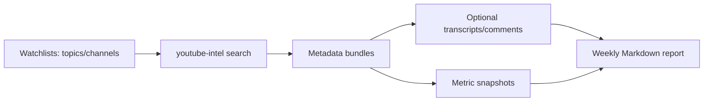

# YouTube Intelligence Stack

Installable local-first CLI for YouTube public-source research: search public videos, collect transcripts/comments/metrics where available, and turn the evidence into weekly Markdown signal reports.

It is a collector plus deterministic report builder. It does not claim full autonomous intelligence, LLM synthesis, source-confidence scoring, or guaranteed YouTube coverage.

This repository is designed as a clean public product: no private watchlists, no cron jobs, no operator data, no API keys, and no generated evidence committed to Git.

## Who is this for?

YouTube Intelligence Stack is for:

- creators tracking new videos, hooks, pains, and audience questions in a niche;
- founders and marketers watching competitor/category narratives;
- researchers building a local evidence archive from public YouTube data;
- AI-agent builders who want a simple file-based pipeline instead of another dashboard.

It is not:

- a YouTube access-control bypass;
- a bot farm;
- a private data collector;
- a fully managed SaaS platform.

## What it does



Main capabilities:

- installable `youtube-intel` CLI;
- `doctor` environment check;
- clean project instances outside the code repo;
- topic-based YouTube search;
- channel watchlists;
- fallback/retry/throttle behavior around `yt-dlp`;
- transcript collection when subtitles are available;
- comment collection when YouTube exposes comments to `yt-dlp`;
- metric snapshots over time;
- weekly Markdown report with pains, migration/replacement signals, platform-risk signals, hooks, and next-action ideas;
- public-safe templates: `general`, `creator`, `competitor`, `ai-tools`.

## Quick start

### Option A — install as a CLI from GitHub

```bash
python3 -m pip install "git+https://github.com/AlekseiUL/youtube-intelligence-stack.git"
youtube-intel doctor
youtube-intel init ~/youtube-intel-demo --template creator
youtube-intel search ~/youtube-intel-demo --query "AI agents" --limit-per-query 3 --skip-watchlist-channels --fresh-only
youtube-intel snapshots ~/youtube-intel-demo --limit 3
youtube-intel report ~/youtube-intel-demo --fresh-only
```

### Option B — run from checkout

```bash
git clone https://github.com/AlekseiUL/youtube-intelligence-stack.git
cd youtube-intelligence-stack
python3 -m venv .venv
source .venv/bin/activate
python -m pip install -e ".[dev]"
youtube-intel doctor
youtube-intel init ~/youtube-intel-demo --template creator
```

You also need a working `yt-dlp` command. Installing the package normally provides it. Verify:

```bash
yt-dlp --version
```

## Project instances

Keep generated evidence outside the code repo:

```bash
youtube-intel init ~/youtube-intel-demo --template creator
```

This creates:

```text
~/youtube-intel-demo/
├── README.md
├── briefing.md
├── status.md
└── watchlists/
    ├── channels.yaml
    └── topics.yaml
```

Edit `watchlists/topics.yaml` and `watchlists/channels.yaml` for your niche.

Templates:

- `general` — broad public-source market radar;
- `creator` — hooks, audience pains, content formats;
- `competitor` — alternatives, switching, pricing complaints, platform risk;
- `ai-tools` — AI agent/tooling research.

## CLI commands

```bash
youtube-intel --help
youtube-intel doctor [project-root]
youtube-intel init <project-root> [--template creator|competitor|ai-tools|general]
youtube-intel search <project-root> [search args]
youtube-intel transcripts <project-root> [transcript args]
youtube-intel comments <project-root> [comment args]
youtube-intel snapshots <project-root> [snapshot args]
youtube-intel report <project-root> [report args]
youtube-intel full <project-root> [search args]
```

Useful filtering flags for weekly/fresh-signal workflows:

```bash
youtube-intel search ~/youtube-intel-demo --query "AI agents" --fresh-only --min-views 100 --min-comments 5
youtube-intel report ~/youtube-intel-demo --max-age-days 7 --min-views 100
```

- `--fresh-only` keeps recently published videos only (`7` days for search, current `--days` window for report).
- `--max-age-days N` keeps only videos with a known publication date within `N` days.
- `--min-views` and `--min-comments` filter weak/empty results before reports.

Legacy checkout syntax still works:

```bash
python run.py init-instance --project-root ~/youtube-intel-demo
python run.py search --project-root ~/youtube-intel-demo --query "AI agents"
```

## Tiny public smoke

```bash
youtube-intel search ~/youtube-intel-demo \
  --query "AI agents" \
  --limit-per-query 3 \
  --skip-watchlist-channels \
  --command-timeout-sec 30 \
  --continue-on-search-error \
  --fresh-only

youtube-intel snapshots ~/youtube-intel-demo --limit 3
youtube-intel report ~/youtube-intel-demo --fresh-only
```

Reports are written under:

```text
~/youtube-intel-demo/data/reports/
```

## Known limitations

This is a best-effort research CLI, not a guaranteed data product.

- YouTube and `yt-dlp` can break or change behavior because of rate limits, `403`/`429` responses, region differences, extractor changes, removed videos, age gates, or metadata availability.
- Transcripts depend on subtitles being available to `yt-dlp`; comments depend on YouTube exposing them to the extractor.
- `--fresh-only` and `--max-age-days` require a known publication date; videos with missing dates are excluded in those modes.
- The report builder is deterministic. It does not perform LLM synthesis, confidence scoring, or source credibility assessment.
- Small samples are explicitly treated as insufficient evidence; collect more videos/comments before treating output as insight.

## Data safety

Generated evidence can become sensitive even when it starts from public sources. Do not commit your instance `data/` directory.

This repo intentionally excludes:

- private watchlists;
- cron schedules;
- generated transcripts/comments/snapshots/reports;
- cookies, browser state, API keys, `.env` files;
- internal workspace paths or operator notes.

## Development checks

```bash
python -m pip install -e ".[dev]"
python scripts/repository_quality.py
python -m pytest -q
youtube-intel doctor
```

## Example output

See:

- [`examples/weekly-report.example.md`](examples/weekly-report.example.md)
- [`examples/instance-layout.md`](examples/instance-layout.md)

## Canonical source

This project is maintained by Aleksei Ulianov / Sprut_AI.
Original repository: https://github.com/AlekseiUL/youtube-intelligence-stack

If you found this project mirrored, repackaged, or redistributed elsewhere, check this repository as the source of truth.

## Attribution

Where permitted by the applicable license, if you reuse, fork, modify, package, or publish this work, keep the original copyright and license notice and link back to the canonical repository.

## License

MIT. See [`LICENSE`](LICENSE).

---

# YouTube Intelligence Stack — RU

Устанавливаемый локальный CLI для YouTube-разведки по публичным источникам: ищет ролики, собирает metadata/transcripts/comments/snapshots и превращает это в weekly Markdown report.

Главное: это **чистая публичная версия**. В репозитории нет личных watchlist'ов, кронов, API-ключей, приватных путей и сгенерированных данных.

## Кому подойдёт

- авторам, которые следят за темами, болями и хуками в своей нише;
- предпринимателям и маркетологам, которые смотрят category narratives;
- researchers, которым нужен локальный evidence archive;
- AI-agent builders, которым удобнее файловый pipeline, а не очередной dashboard.

## Быстрый старт

```bash
python3 -m pip install "git+https://github.com/AlekseiUL/youtube-intelligence-stack.git"
youtube-intel doctor
youtube-intel init ~/youtube-intel-demo --template creator
youtube-intel search ~/youtube-intel-demo --query "AI agents" --limit-per-query 3 --skip-watchlist-channels --fresh-only
youtube-intel snapshots ~/youtube-intel-demo --limit 3
youtube-intel report ~/youtube-intel-demo --fresh-only
```

Сгенерированные данные лежат в project instance, а не в кодовом repo. Это специально: так безопаснее публиковать код и не таскать за собой приватную исследовательскую историю.
